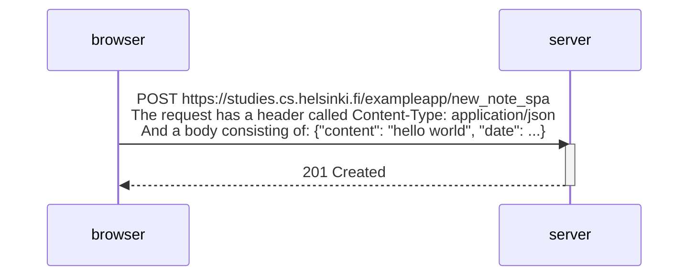

```mermaid
sequenceDiagram
    participant browser
    participant server

    browser->>server: POST https://studies.cs.helsinki.fi/exampleapp/new_note_spa<br>The request has a header called Content-Type: application/json<br>And a body consisting of: {"content": "hello world", "date": ...}
    activate server
    server-->>browser: 201 Created
    deactivate server

```